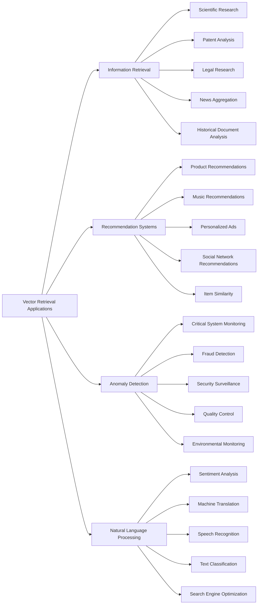
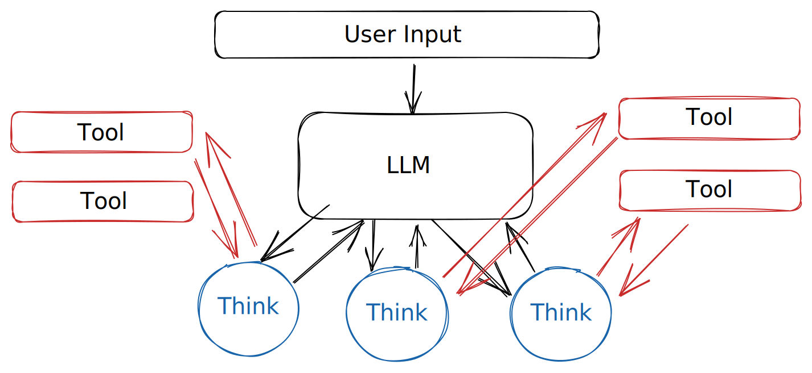

# Backstory

<figure><figcaption></figcaption></figure>

## Who is Jeeves?

Jeeves comes from the P.G. Wodehouse series, featuring Bertie Wooster, a well-intentioned but not exactly the brightest bulb in the chandelier, who frequently stumbles into amusing predicaments that would have most people at their wits' end. Luckily for him, his exceedingly intelligent and resourceful valet, Jeeves, is always on hand to save the day.&#x20;

With an uncanny ability to untangle even the most complex of situations, Jeeves essentially carries Bertie through life, ensuring that he emerges unscathed from his numerous comedic misadventures. The delightful interplay between the bumbling Bertie and the unflappable Jeeves is at the heart of the series' charm, as they navigate the trials and tribulations of early 20th-century British high society with equal parts wit and panache.

> Very good, sir. It is, of course, merely a trifle, but one must cling to trifles in this imperfect world. –– Jeeves, in _My Man Jeeves_

## Artificial Intelligence

As AI rapidly advances, the world finds itself at a pivotal crossroads. With innovations in generative AI revolutionizing the way we interact with technology, our society is undoubtedly on the brink of unprecedented change, if not within it already. Amidst the excitement of technological advancements, we must also consider the concerns and responsibilities that accompany the power of AI, as we stand on the cusp of a new era.&#x20;

### ChatGPT, the Consumer-Facing Successor to GPT-3

ChatGPT, a consumer-facing web app, is the public version of the GPT-3.5 (later turbo-ified) model that succeeded GPT-3. While GPT-3 had already been released and in use by developers for a few years, ChatGPT shocked the world simply by being accessible to anyone. It famously became the fastest-growing product in history (in terms of monthly active users).&#x20;

GPT-4, on the other hand, represented a giant leap forward in LLM reasoning, drastically more performant on standardized tests and providing better responses due to months of internal reinforcement learning, evaluations, and leveraging data from ChatGPT's public usage.&#x20;

### Vector Retrievals and the New Language of Computer Science

Vector retrievals involve using high-dimensional vector spaces (embeddings) to represent words, phrases, and complex data, facilitating efficient searching and manipulation of information. These techniques can be applied to various industries, such as medicine, law, finance, and more. Some examples include:

1. **Information Retrieval**: Vector embeddings can be used to search through large document repositories, allowing for highly accurate retrieval of relevant sources from a highly populated data pool. Specific examples within information retrieval include:
   * **Scientific Research**: Quickly finding the most relevant research in vast repositories of scientific articles, streamlining literature reviews and keeping researchers up-to-date with the latest findings in their field.
   * **Patent Analysis**: Identifying relevant patents in large databases by comparing vector representations of patent abstracts, aiding businesses and inventors in analyzing the patent landscape, identifying potential infringement issues, or finding inspiration for new innovations.
   * **Legal Research**: Expedited discovery of relevant case law, statutes, or regulations by comparing vector embeddings of legal documents, enabling legal professionals to efficiently prepare for cases and provide accurate advice to clients.
   * **News Aggregation**: Automatically curating news articles based on a user's interests by analyzing vector representations of article headlines or summaries, helping readers stay informed on topics that matter most to them.
   * **Historical Document Analysis**: Uncovering connections between historical texts by comparing their vector embeddings, assisting historians in discovering new insights or identifying previously overlooked relationships between events, individuals, or ideas.
2. **Recommendation Systems**: Identifying similar items (e.g., movies, books, products) in large databases by comparing their vector embeddings, enabling more accurate and personalized recommendations for users.
3. **Anomaly Detection**: Analyzing sensor data in real-time by comparing vector embeddings to detect unusual patterns or events, which can be particularly useful in monitoring critical systems or infrastructure.
4. **Natural Language Processing**: Using vector embeddings to identify semantic similarities between words or phrases, enabling AI models to better understand and process human language, leading to improved performance in tasks like sentiment analysis, text classification, and machine translation.

For more information on vector retrievals and specific use cases, visit [URSI.ai](https://docs.ursi.ai).

### LLM Agency

Significant advancements in transformer processing have opened the doors to new techniques designed to extract the greatest value possible from an LLM, beyond the confines of text-in/text-out. One promising approach is _agency_, which involves utilizing LLMs to generate reasoning traces and task-specific actions in an interleaved manner. This methodology, in its first form called ReAct, provides greater synergy between reasoning and acting components and leads to improved human interpretability and trustworthiness over models that lack these components (pretty much all of them).&#x20;

ReAct is a flexible LLM framework that synergizes reasoning and acting in language models. It has demonstrated its effectiveness over state-of-the-art baselines across various language and decision-making tasks. Another notable tool in the LLM agency domain is MRKL (pronounced "miracle"), which also focuses on the integration of reasoning and acting components in LLMs. In a nutshell, they provide a framework for using an LLM to direct non-LLM automated activity, whose result can be passed _back_ into the LLM for final analysis or recursion.

Both ReAct and MRKL have been the subjects of published research papers, showcasing their potential in various applications such as text generation, search, and question-answering. These tools' ability to synergize reasoning and acting components paves the way for more advanced, interpretable, and trustworthy AI systems. The genius of these research papers and their resultant implementations, such as [LangChain](https://docs.langchain.com/docs/) and [Haystack](https://haystack.deepset.ai/), empower Jeeves.

### The World at a Crossroads

As AI models like ChatGPT and GPT-4 continue to advance, the world is changing at an unprecedented pace. These tools are driving that change, and technology will never be the same. We now stand at one of the most important crossroads in the history of humanity. However, with rapid advancements come considerations and hesitations.

Notable figures like Elon Musk and Max Tegmark, among others, have penned an [open letter](https://futureoflife.org/open-letter/pause-giant-ai-experiments/) advocating for a halt on the development of models larger than GPT-4.&#x20;

I can say for a fact that while AI developers are passionate about their work, there's undeniably an undertone of hesitancy, born from the ever-growing realization that the capabilities unlocked are both impressive and deeply frightening. The exponential rate of development has left us far ahead of where we thought we'd be even in recent history, and thus, philosophy and regulation are far from catching up.

As we continue to develop and refine these powerful tools, we must also grapple with the implications and responsibilities that come with such advancements. As Jeeves said, "the mood will pass, sir, but the consequences will linger."
